# cracking-enigma

#### Zespół
- Maciej Pliszek
- Grzegorz Pańczuk
- Mikołaj Żurek

### Opis aplikacji
Aplikacja służy do szyfrowania oraz deszyfrowania plików tekstowych. Użytkownik ma do wyboru zarówno trzy metody szyfrowania jak i deszyfrowania, weryfikujące możliwości łamania użytych szyfrów.

---
### Analiza MoSCow
#### Must have (Muszą być):

1. Możliwość wyboru pliku tekstowego do szyfrowania.
2. Interfejs użytkownika umożliwiający podanie klucza szyfrowania.
3. Implementacja algorytmu szyfrowania i deszyfrowania.
4. Implementacja algorytmu łamania szyfru (np. brute force).

#### Should have (Powinno być):

1. Obsługa różnych algorytmów szyfrowania.
2. Możliwość zapisu zaszyfrowanego pliku na dysku.
3. Możliwość zapisu klucza szyfrowania na dysku.

#### Could have (Może być):

1. Interfejs graficzny umożliwiający wybór algorytmu szyfrowania.
2. Możliwość wyboru lokalizacji zapisu zaszyfrowanego pliku.
3. Możliwość szyfrowania wiadomości e-mail.
4. Możliwość wpisania textu do zaszyfrowania bezpośrednio w aplikacji.

#### Won't have (Nie będzie):

1. Implementacja zaawansowanych funkcji szyfrowania, które są poza zakresem podstawowej funkcjonalności aplikacji.
2. Integracja z zewnętrznymi usługami chmurowymi do przechowywania zaszyfrowanych plików.
3. Dodatkowe funkcje bezpieczeństwa, takie jak hasło logowania do aplikacji.
4. Możliwość szyfrowania innych typów plików niż tekstowe.
5. Implementacja mechanizmu automatycznego wylogowywania użytkownika po określonym czasie nieaktywności.
---

### Diagram Use-Case

```mermaid
flowchart LR
    subgraph 'System'
    uc1((Szyfruj Plik))
    uc2((Odszyfruj Plik))
    uc6((Złam Szyfr))
    uc3((Wybierz plik z dysku))
    uc4((Wybierz metodę szyfrowania))
	uc5((Wybierz metodę deszyfrowania))

    end
    customer[Użytkownik👤]

    customer----->uc1
    customer-->uc2
    customer -. include .-> uc6
    uc1 -. include .-> uc3
    uc3 -. include .-> uc4
    uc2 -. include .-> uc3
    uc3 -. include .-> uc5
    
```

---

### Wymagania 
###### Funkcjonalne:
- Szyfrowanie tekstów podanych przez użytkownika przy pomocy kilku zaimplementowanych algorytmów szyfrujących
- Deszyfracja zaszyfrowanych tekstów przy pomocy kilku zaimplementowanych metod deszyfracji
- Łamanie zaszyfrowanych plików

###### Niefunkcjonalne:
- Prosty i czytelny interfejs
- Stabilna praca bez błędów krytycznych
---

### Repozytorium
github: https://github.com/programowanie-obiektowe-projekt/cracking-enigma

### Raport zadań przypisywanych na tablicy Kanban
Maciej Pliszek:
- Wybranie systemu kontroli wersji i utworzenie repozytorium, wybranie metody programowania zwinnego
- Diagram przypadków użycia

Grzegorz Pańczuk:
- Wymagania funkcjonalne i niefunkcjonalne

Mikołaj Żurek:
- Opis działania aplikacji
- Analiza MoSCoW
