# cracking-enigma

#### Team
- Maciej Pliszek
- Grzegorz Pańczuk
- Mikołaj Żurek

### Application Description
The application is used for encrypting and decrypting text files. Users can choose from three methods of encryption and decryption. Methods for breaking ciphers are also provided.

---
### MoSCoW Analysis
#### Must have:

1. Ability to select a text file for encryption.
2. User interface that allows entering an encryption key.
3. Implementation of encryption and decryption algorithms.
4. Implementation of a cipher-breaking algorithm (e.g., brute force).

#### Should have:

1. Support for various encryption algorithms.
2. Ability to save the encrypted file to disk.
3. Ability to save the encryption key to disk.

#### Could have:

1. Graphical interface allowing the selection of the encryption algorithm.
2. Ability to choose the location to save the encrypted file.
3. Ability to encrypt email messages.
4. Ability to enter text to be encrypted directly in the application.

#### Won't have:

1. Implementation of advanced encryption features beyond the basic functionality of the application.
2. Integration with external cloud services for storing encrypted files.
3. Additional security features such as password protection for the application.
4. Ability to encrypt file types other than text files.
5. Implementation of an automatic logout mechanism after a period of inactivity.

---

### Use-Case Diagram

```mermaid
flowchart LR
    subgraph 'System'
    uc1((Encrypt File))
    uc2((Decrypt File))
    uc6((Break Cipher))
    uc3((Select file from disk))
    uc4((Select encryption method))
    uc5((Select decryption method))
    uc7((Select cipher-breaking method))

    end
    customer[User👤]

    customer----->uc1
    customer-->uc2
    customer --> uc6
    uc1 -. include .-> uc3
    uc3 -. include .-> uc4
    uc2 -. include .-> uc3
    uc3 -. include .-> uc5
    uc6 -. include .-> uc3
    uc3 -. include .-> uc7
    
```

---

### Requirements 
###### Functional:
- Encryption of texts provided by the user using several implemented encryption algorithms.
- Decryption of encrypted texts using several implemented decryption methods.
- Breaking of encrypted files.

###### Non-functional:
- Simple and readable interface.
- Stable operation without critical errors.

---
### Technologies

The application was developed using the Flask framework, with the Bootstrap class library installed for the user interface. The Crypto library is responsible for cryptographic algorithms.

### Design Patterns

The design patterns used are:
- Factory Pattern
- Adapter
- Strategy Pattern
- Decorator

### Tests

Unittest was used for testing. The application's logic layer was tested, but the user interface was not tested. The total code coverage by tests is 54%.

---
### Repository
github: https://github.com/programowanie-obiektowe-projekt/cracking-enigma
