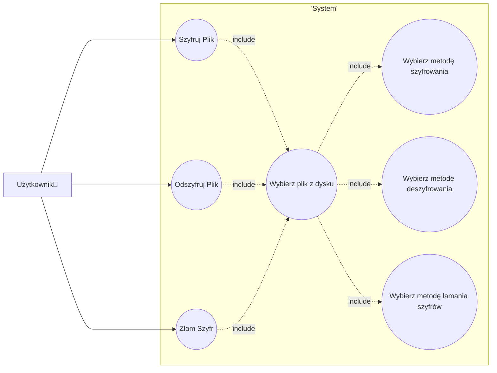

# cracking-enigma

#### Zespół
- Maciej Pliszek
- Grzegorz Pańczuk
- Mikołaj Żurek

### Opis aplikacji
Aplikacja służy do szyfrowania oraz deszyfrowania plików tekstowych. Użytkownik ma do wyboru zarówno trzy metody szyfrowania jak i deszyfrowania. Udostępnione również są metody do łamania szyfrów.

---
### Analiza MoSCow
#### Must have (Muszą być):

1. Możliwość wyboru pliku tekstowego do szyfrowania.
2. Interfejs użytkownika umożliwiający podanie klucza szyfrowania.
3. Implementacja algorytmu szyfrowania i deszyfrowania.
4. Implementacja algorytmu łamania szyfru (np. brute force).

#### Should have (Powinno być):

1. Obsługa różnych algorytmów szyfrowania.
2. Możliwość zapisu zaszyfrowanego pliku na dysku.
3. Możliwość zapisu klucza szyfrowania na dysku.

#### Could have (Może być):

1. Interfejs graficzny umożliwiający wybór algorytmu szyfrowania.
2. Możliwość wyboru lokalizacji zapisu zaszyfrowanego pliku.
3. Możliwość szyfrowania wiadomości e-mail.
4. Możliwość wpisania textu do zaszyfrowania bezpośrednio w aplikacji.

#### Won't have (Nie będzie):

1. Implementacja zaawansowanych funkcji szyfrowania, które są poza zakresem podstawowej funkcjonalności aplikacji.
2. Integracja z zewnętrznymi usługami chmurowymi do przechowywania zaszyfrowanych plików.
3. Dodatkowe funkcje bezpieczeństwa, takie jak hasło logowania do aplikacji.
4. Możliwość szyfrowania innych typów plików niż tekstowe.
5. Implementacja mechanizmu automatycznego wylogowywania użytkownika po określonym czasie nieaktywności.
---

### Diagram Use-Case

---

### Wymagania 
###### Funkcjonalne:
- Szyfrowanie tekstów podanych przez użytkownika przy pomocy kilku zaimplementowanych algorytmów szyfrujących
- Deszyfracja zaszyfrowanych tekstów przy pomocy kilku zaimplementowanych metod deszyfracji
- Łamanie zaszyfrowanych plików

###### Niefunkcjonalne:
- Prosty i czytelny interfejs
- Stabilna praca bez błędów krytycznych

---
### Technologie

Aplikacja powstała przy użyciu frameworka Flask, w któym zainstalowano bibliotekę klas stylów Bootstrap wykorzystaną do interfejsu użytkownika. Za algorytmy kryptograficzne odpowiada biblioteka Crypto.

### Wzorce projektowe

Zastosowane wzorce projektowe to:
- Factory Pattern
- Adapter
- Strategy Pattern
- Decorator

### Testy

Do testów wykorzystano unittest. Przetestowana została warstwa logiczna aplikacji, natomiast nie testowano interfejsu użytkownika. Całkowite pokrycie kodu testami wynosi 54%.

---
### Repozytorium
github: https://github.com/programowanie-obiektowe-projekt/cracking-enigma
